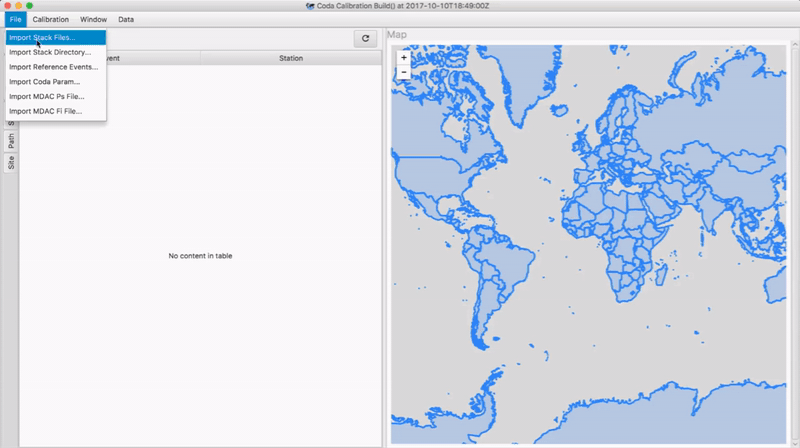

The `Coda Calibration Tool` (CCT) is a Java based application for calibrating 1D shear wave coda measurement models to observed data using a much smaller set of reference MWs calculated from other means (waveform modeling, etc.). 
<br/>These calibrated measurement models can then be used in other tools to generate coda MW measurements, source spectra, estimated stress drop, and other useful measurements against the rest of the events and any new data collected in the calibrated region.

> ***<sub>note</sub>*** <br/>
> The `Coda Calibration Tool` currently only does calibration; it requires data to be pre-processed for loading using other tools. 

***
## [Demo](#demo)



<sub>Data courtesy of [Northern California Earthquake Data Center](http://ncedc.org/)</sub>

***
## [Structure](#structure)

CCT is split into three basic components. 

A REST service that consumes Waveform objects containing stacked coda envelope segments and information about the station and event locations. This service does all the actual calculations to calibrate the model.

A JavaFX/HTML5/Swing GUI application that understands how to convert stack files (see [Data](#data)) to Waveform objects, interact with the REST Calibration service, and display useful diagnostic plots with the resulting data.

And a wrapper project (Standalone) that combines both into a single runnable JAR file to allow end users to run the GUI and Service together the same way they would run any other desktop application.

CCT is based on [Spring 5.0](https://spring.io/); primarily Boot and Data. By default, it uses a [H2](http://www.h2database.com/html/main.html) in-memory database for storing loaded Waveforms and the resulting calibration artifacts.

***
## [Building](#building)
CCT uses [Apache Maven](https://maven.apache.org/) for building and dependency management. 

From the top level `coda-calibration` directory you can build the entire project using the parent pom by running:
```shell
mvn clean package
```

We don't presently deploy versioned artifacts into a public repository like the [Maven Central Repository](https://maven.apache.org/repository/index.html) but we may do so in the future.
***
## [Running](#running)

#### **As a single runnable JAR**

```shell
java -jar coda-calibration/calibration-standalone/target/calibration-standalone-1.0.0-runnable.jar
```

#### **GUI alone**

```shell
java -jar coda-calibration/calibration-gui/target/calibration-gui-1.0.0-runnable.jar
```
#### **Calibration REST service alone**

```shell
java -jar coda-calibration/calibration-service/application/target/application-1.0.0-runnable.jar
```

#### A note about HTTPS
If you look at the REST service and the GUI client packages you might have noticed 'selfsigned.crt' and 'coda-truststore.jks' in the resources directory. CCT uses HTTPS by default and these are the default certificates we include for the handshake between the client and the GUI.

You can use these as-is or use your own by changing these properties using any of the [Spring external configuration](https://docs.spring.io/spring-boot/docs/current/reference/html/boot-features-external-config.html) mechanisms:

* On the client:
```text
webclient.trustStoreName
webclient.trustStorePass
```

* On the REST service:
```text
server.ssl.key-alias
server.ssl.key-password
server.ssl.key-store
server.ssl.key-store-provider
server.ssl.key-store-type
```

This additional step is recommended for deployments where the REST service is bound to a non-loopback adapter.

***
## [Data Formats](#data)

As of 1.0, CCT is capable of loading four basic file types

1. Stacked coda envelopes

   These stacked envelopes are filtered into the same frequency ranges as those defined in the coda model parameters (3). Presently, the CCT GUI only has converters for [SAC](http://ds.iris.edu/ds/nodes/dmc/software/downloads/sac/) files and, as a result, requires the file names to follow a specific format to capture the frequency band information. 

   ```text
   STATION_CHANNEL_EVENTID_LOWFREQ_HIGHFREQ_UNITS_.*.env
   (e.g. ANMO.STACK.999999_1.0_1.5_VEL_.env)
   ```

2. Reference events

   A simple space delimited text file of format:

   ```text
   EVID MW [STRESS_DROP_IN_MPA|0.0]
   (e.g. 999999 5.1 0.0)
   ```
   > ***<sub>note</sub>*** <br/>
   > The EVID here should match the one defined in either the KEVNM or NEVID (tested in that order) fields of the SAC files being loaded so the envelope waveforms can be associated correctly during calibration.

3. Coda model parameters

   This defines the frequency bands and some corresponding frequency dependent parameters to be used during calibration.
   ​

4. Phase and frequency model parameters for distance amplitude correction curves

   > ***<sub>note</sub>*** <br/>
   >
   > While CCT supports loading MDAC2 model descriptor files, it presently only uses it for predicted source spectra. 
   > As a result, the two parameters of most interest for calibration purposes are Psi and Sigma. These correspond to apparent or actual stress drop of the spectra depending on their values. 
   > See the [additional reading](#references) for more information.

***
## [Contributing](#contributing)

Contributing to CCT is easy:  just send us a [pull request](https://help.github.com/articles/using-pull-requests/).

When you send your request, make ``develop`` the destination branch.

The ``develop`` branch contains the latest contributions, and ``master`` always points to the latest stable.

Issues, suggestions, discussion, documentation, general code cleanup, and automated tests are also all valuable ways to contribute and are more than welcome!

***
## [Additional Reading](#references)

[Mayeda, K.M., A. Hofstetter, J.L. O Boyle, W.R. Walter (2003). Stable and transportable regional magnitudes based on coda-derived moment-rate spectra, Bull. Seism. Soc. Am., 93, 224-239.](http://bssa.geoscienceworld.org/content/93/1/224)

***
## [Versioning](#versioning)

We use [Semantic Versioning](http://semver.org/) for versioning. For the versions available, see the tags on this repository. 

***
## [License](#license)

The `Coda Calibration Tool` is provided under the [Apache License](LICENSE.txt).

```text
 Copyright 2017 Lawrence Livermore National Laboratory

   Licensed under the Apache License, Version 2.0 (the "License");
   you may not use this file except in compliance with the License.
   You may obtain a copy of the License at

       http://www.apache.org/licenses/LICENSE-2.0

   Unless required by applicable law or agreed to in writing, software
   distributed under the License is distributed on an "AS IS" BASIS,
   WITHOUT WARRANTIES OR CONDITIONS OF ANY KIND, either express or implied.
   See the License for the specific language governing permissions and
   limitations under the License.
```

***
## [Disclaimer](#disclaimer)
```text
  This work was performed under the auspices of the U.S. Department of Energy 
  by Lawrence Livermore National Laboratory under Contract DE-AC52-07NA27344.
```

``LLNL-CODE-743439``
