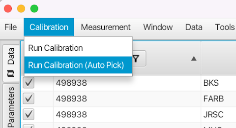
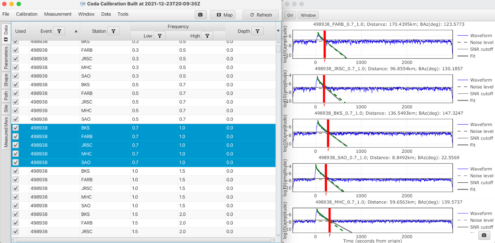
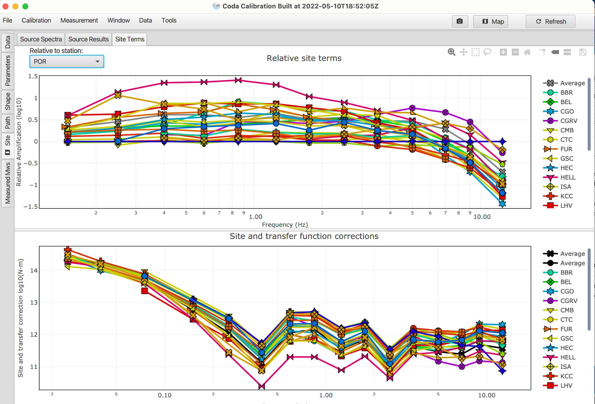
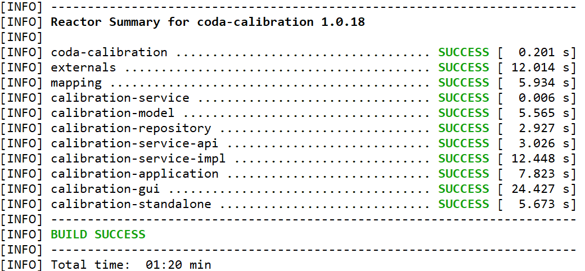

# Coda Calibration Tool (CCT) 1.0.18 documentation
<sub>2022-07-31; Version 1.0; Authors Barno, Justin | Mayeda, Kevin</sub>

## About CCT

The Coda Calibration Tool (CCT) is a Java-based application that stems from a collaborative project by scientists from the USNDC (AFTAC/SDS) and DOE (LLNL) as well as significant input from seismologists from the University of Utah, INGV (Milan) and USGS (Golden, CO), Natural Resources Canada. This tool consolidates research-mode scripts circa 1995 (SAC, C-shell, Fortran) into a robust platform-independent tool using the empirical 1-D method outlined by [Mayeda and Walter (1996)](https://doi.org/10.1029/96JB00112) and [Mayeda et al. (2003)](https://doi.org/10.1785/0120020020).

CCT provides a fast and efficient means of calibrating and processing local and regional coda envelopes to estimate stable source spectra, moment magnitude, and apparent stress, that are roughly 3-to-4 times less variable than estimates derived from traditional direct wave estimates. The source parameters represent averaged values and are virtually free of lateral path heterogeneity and source radiation anisotropy. 

The methodology has two options for dealing with potential regional source scaling. In the first (and preferred) case, independent, ground-truth reference source spectra are used in the calibration process to constrain the frequency-dependent site terms. In the second case, reference events with independent **M<sub>w</sub>** estimates are used to constrain the long-period site terms, but for the higher frequencies we impose a [Brune (1970)](https://doi.org/10.1029/JB075i026p04997) source spectrum with an a priori source scaling, currently set so that the apparent stress increases as **~M<sub>o</sub> 0.25**.

## Tutorial Guide for New Users 

The following is a step-by-step guide for a specific example taken from the San Francisco Bay Area region using broadband waveform data from the UC Berkeley Seismological Laboratory.

!!! Note 
    For a new dataset and region, you should expect to run CCT multiple times before settling on a final coda calibration. 
    
    Initial calibrations invariably will require finding and removing problem events/envelopes/stations that for whatever reason prevent the code from finding the ‘best’ model parameters.

Overwriting the Envelope directory during the initial QA of the data is common. The data set from the SF Bay area was reviewed several times and the resulting calibration is very stable, but this serves as a good example of how you might calibrate your own dataset.

### Getting Started
#### Downloading CCT

The latest version of the Coda Calibration Tool (CCT) can be found on the [release page](https://github.com/LLNL/coda-calibration-tool/releases/)

The standalone CCT jar file is calibration-standalone-1.0.18-runnable.jar while the REST services only are available in calibration-application-1.0.18-runnable.jar.

#### Downloading SF Bay Area example tarfile

The complete SF Bay Area calibration which includes SAC waveforms, stacked envelopes and JavaScript
Object Notation (JSON) parameter files can be [downloaded here](https://doi.org/10.5281/zenodo.6902890)

#### Running CCT

You can launch CCT by executing Java from the command line as:

``` java -Xmx12g -jar calibration-standalone-1.0.18-runnable.jar ```

Or, if you have Java 11+ as:

``` java -XX:MaxRAMPercentage=70.0 -jar calibration-standalone-1.0.18-runnable.jar ```

Generally your -Xmx flag should be set to, at most, ~70% of the physical RAM available on the machine.

You can add the ``` --spring.profiles.active=file ``` flag to the Java call if your dataset is larger than the physical RAM on your machine.
This will output a large database file that is also useful if you want to save the entire database or connect to it with an external database browser tool. The tradeoff is that you have to wait for the read/write times of the hard drive so this mode can be slower than the default RAM-only mode.

### Recommendations For Selecting Calibration Data

For a stable and robust calibration, it is best to choose larger events with good SNR that are distributed geographically in the region of interest and recorded by a large number of stations. In addition to broad event distribution, the stations should also be well distributed, otherwise it is difficult to constrain the path terms.

Furthermore, it is best to choose clean records that have little if any aftershocks that might contaminate the coda. Including lots of questionable events can ruin the calibration so it is far better to be selective in the choice of events…, more events is not necessarily better! 

For the SF Bay Area example dataset, there is an abundance of seismicity and many broadband stations to choose from. In this case we have 10 broadband stations and 40 events which is more than sufficient for constraining the calibration parameters (e.g ., we could have used 75% less events and stations and would have obtained nearly the same calibration). We could likely have comparable results with far less events and stations. 

For example, in the coda calibration in Israel outlined in [Mayeda et al. (2003)](https://doi.org/10.1785/0120020020) we used only two stations on opposite ends of the country and a smattering of events throughout the country. With regard to the length of SAC waveform segments, for regional events ranging between ~3.5< **M<sub>w</sub>** <6, it is recommended to choose window lengths of ~-300 sec to ~2000 sec relative to the origin time. 

These longer records are necessary for the long-period surface wave codas (0.02< f <0.3-Hz) for the larger events, but depending on the seismicity level, you can modify the window lengths. For a very local calibration (~<100 km), with only small magnitude events (**M<sub>w</sub>** < ~4.0), window lengths of -50 to 400 seconds relative to the origin time might suffice.

Once the envelopes are formed, they are decimated so they will not take up as much space.

### Creating Envelopes with SAC Waveform Data

#### Initial Waveform Data

1. CCT requires SAC files. Horizontal components are preferred, but you can use verticals, just don’t mix them and keep in separate folders. Envelope tool will stack all components for an event recorded at station X. 

The tool will use the SAC header variables for the event name (**KEVNM**) and station name (**KSTNM**) in the SAC header to create the names for the envelope files. 

!!! Note
    The Envelope tool only cares about event time and network/station/channel name. Everything else is optional, though we recommend loading the SAC headers completely.

2. Deconvolve instrument response to velocity in nm/sec. Check that the **IDEP** parameter in the SAC headers is ‘**VELOCITY (NM/SEC)**’.

3. Set both station and event location headers (i.e., **STLA**, **STLO**, **EVLA**, **EVLO**)

4. Set origin time to 0 seconds.

Below is an example header of one of the horizontal components. 

Event origin time must be 0 in the ‘**OMARKER**’ header. This can be done using the "ch" command in SAC as follows for the example waveform from Tajikistan (TJ.CHGR): 

``` sac> ch o gmt 2010 342 08 21 34 560 ``` (to introduce the event origin time) 

``` sac> ch allt ( -1 * &1,o ) ``` (all times are shifted.., begin (B), end (E) to match the ‘**OMARKER**’)

!!! Warning 
    If ‘**OMARKER**’ and event locations are not set in the SAC header CCT will not work.

 <figcaption align = "center">Figure. 1, A raw input waveform</figcaption> <br/>

 <figcaption align = "center">Figure. 2, The related SAC headers</figcaption>

#### Envelope Formation

1. Start the envelope tool from the main CCT menu 
    * Tools > Create Envelopes

2. Load a parameter file:   
    * File > Import Job Config... 
    (Choose the JSON file that defines the frequency bands you are interested in such as envelope-bands.json)
     <figcaption align = "center">Figure. 3, Importing an envelop job configuration file.</figcaption>

3. The envelope tool is flexible, allowing you to create other frequency bands or different bandwidths if needed. This can be done by selecting "Band Generation Settings" with overlap and log 10 (or linear) spacing. More overlap will result in smoother spectra.
 <figcaption align = "center">Figure. 4, Generating bands from a specification instead.</figcaption><br/>

4. Load SAC waveform files: File > Envelopes from Directory... or File > Envelopes from Files… Choose your processed SAC files. Warning! If you choose "Envelopes from Directory", the tool will attempt to process all files in the directory as well as in all subdirectories. Therefore, it is recommended to store your processed SAC waveforms in their own directory (without any extraneous files or subdirectories).

5. Immediately you will be prompted to choose a location for your output envelopes. We recommend a subdirectory called "Envelopes" in the working data directory (i.e. , Data_new/Envelopes).

6. Close the Envelope Tool when the progress bar completes.
The envelopes will be created in the following directory structure: ...Data_new/Envelopes/YEAR/MONTH/EVID/STATION/STA_COMP_EVID_FREQ1_FREQ2_VEL_.ENV In subsequent steps, you can import all stack envelopes created in this envelope tool with "File > Import stack directory…" and choose the "Envelopes" directory.

### San Francisco Bay Example Dataset

#### Untar Example File and Description

In a terminal window copy and untar the **Bay_Area_CCT_Example.tar** to your directory of choice. This should be the working directory from which you run CCT.

You should see the following files and directories:

 <figcaption align = "center">Figure. 5, Example data set list.</figcaption> <br/>

* **Calibration_Data** *directory*

    Upon completion of calibration, you can export this directory which includes the most current JSON calibration parameter file that includes frequency-dependent parameters for site-correction, envelope shape, velocity, path-correction, minimum and maximum coda window length, GT reference events with apparent stress, and reference **M<sub>w</sub>**’s. Additionally there are separate site correction files for each station that was calibrated. All files in this example are in ASCII format.

* **Calibration_Parameters_Kevin.json** *file*

    Parameter file that represents the ‘final’ JSON file for the Bay Area coda calibration (taken from the Calibration_Data directory and renamed). This could be used for automated processing of future events, or as a starting point in any future updated calibration if new events or stations were acquired.

* **Data_new** *directory*

    Directory of deconvolved broadband horizontal component velocity SAC waveforms for each event and station. The envelope tool was used to form these envelopes (already applied in this example) and were copied to the Envelope_stack_Kevin_picks directory.

!!! Warning
    If other components exist in the Data_new directory, such as the vertical component or other sampling rate channels, then they will all be added to the final stacked envelope. Only include in this directory the components for which you intend on using in the calibration! Also, it will search sub-directories so be aware!

* **Envelope_stack_Kevin_picks** *directory*
    
    Directory of stacked, log 10 averaged horizontal envelopes for pre-determined narrow frequency bands that have been manually QA’d and measurement end times were picked ( f-markers ).

* **Mw_CMT_BSL.dat** *file*
    
    ASCII file of independent moment magnitudes determined from full waveform inversion courtesy of Doug Dreger at the Berkeley Seismological Laboratory (BSL). These SF Bay area events can be used for calibration and/or validation. Some of these events were added to the end of the Calibration_Parameters_Kevin.json file.

* **application.properties** *file*
    
    Optional configuration override file for CCT. This example shows how to use other independent map layers from a WMS 1.3 server (e.g., NASA WorldWind) to be included in the CCT maps. Note : This file must reside in the directory where CCT is initiated.

* **Envelope-bands.json** *file*
    
    JSON file that controls the frequency bands for creating new envelopes using the envelope tool. There are options for smoothing and interpolation if you choose to change the preset values.

### Step-by-Step Bay Area CCT Example

#### Read in necesssary data

Read in stacked envelopes using the pulldown tab: File>Import Stack Directory…
 <figcaption align = "center">Figure. 6, Importing stacked envelopes in a directory.</figcaption> <br/>

Select the **Envelopes_stack_Kevin_picks** directory

You will see the following Task-Progress pop-up window as the envelopes are being read in (roughly 7 seconds on my machine).

Upon completion you’ll see this:

 <figcaption align = "center">Figure. 7, Dialog showing amount of envelopes imported, errors (if any), and if the process has completed.</figcaption> <br/>

Next, read in the Coda Parameter file: File>Import Coda Param...

Select the **Calibration_Parameters_Kevin.json** file (This reads instantly)

To view the data in map form, click the Map button in the upper right. In the upper right map pop-up, select the tile pull-down in the upper right. Be sure the application.properties file is in the working directory if you want to use custom layers. You can click on a station or event to see the corresponding name and view envelopes. 

 <figcaption align = "center">Figure. 8, The CCT map showing a custom WMS layer featuring the [USGS topographic](https://basemap.nationalmap.gov/arcgis/rest/services/USGSTopo/MapServer) map.</figcaption> <br/>

!!! Note
    If you want to take a high resolution image, you can click the camera icon in the lower left corner.

#### Run the calibration

 <figcaption align = "center">Figure. 9, Beginning a calibration in CCT.</figcaption> <br/>

At this point you have two choices. If this were a brand new calibration, then none of the envelopes have been picked with measure end times (**f-markers**) so you can choose **Run Calibration (Auto Pick)** which uses a simple STA/LTA kind of approach to find the ‘best’ end time measurement. 

This provides a good initial estimate but you will find that many need to be refined manually to change the auto-picked **f-markers**, then re-run the calibration again. Auto-picked envelopes will always have an ‘**ap**’ designation on each envelope at the peak S -wave arrival but if you manually change the **f-marker** and export the envelopes, the ‘**ap**’ will disappear the next time the data is read into CCT.

For this example however, use the other pull-down option which is Run Calibration. This will use the existing **f-marker** picks in the SAC headers (manual and auto-picked) and begin fitting the envelopes to obtain the envelope shape parameters (e.g., **𝜸** and **b**), peak S-velocity as a function of distance (e.g., **V(r|f)**), perform path correction inversion (e.g., **P(r|f)**), and finally site correction determination using predetermined ground-truth (GT) source spectra (e.g., **\[S(f)·T(f)\]**). This takes less than 2 minutes on my machine and you can close the Progress pop-up screen if you want without affecting the calibration progress.

#### QA Results (vertical tabs)

#### Data tab 

This is the single most important QA feature of the tool because it allows you to manually re-pick envelopes or eliminate bad traces, then you will have to re-run CCT to get a more refined calibration.

Calibrations are only as good as the input data so it’s important to eliminate bad envelopes or make time pick adjustments, then repeat the calibration. Through an iterative process the calibration parameters will be better constrained and robust. 

Adjusted picks can either be written out to a new folder or to the existing folder (see below for more details).

#### Sorting & Re-Picking Events 

In the data table, under the frequency column heading, you can click on the low heading tab and this will sort the bands from lowest to highest frequency based on the low end of the frequency band. 

Similarly, by clicking on the station column heading you can sort by station in alphabetical order or the event column heading and it will sort by event ID.

 <figcaption align = "center">Figure. 10, Selecting a row to view the associated waveform record.</figcaption> <br/>

By clicking on any event row (above figure) a pop-up window of the observed envelope (blue), best fit synthetic (green), and model (gray) will appear (see below figure). 

 <figcaption align = "center">Figure. 11, Waveform record plot with associated metadata.</figcaption> <br/>

The **f-marker** (red vertical line) can be adjusted by clicking, then dragging the **f-marker** with the mouse. Place the **f-marker** before the envelope returns to the pre-event noise level and also before any visible aftershocks in the coda. 

Results will be most accurate when the synthetic envelope and model envelope (green and gray lines, respectively) match. For example, sometimes the fit and model envelopes will diverge towards the end of the envelope, and it is best to place the **f-marker** before they diverge, if possible. 

Group velocity markers can be toggle on with the "GV" button. This shows the expected phase onset time given the event origin time and distance based on the start and stop velocity settings in the parameter tab.

The minimum and maximum window time restrictions for the length of the coda window can be visualized by toggling the "Window" button. The window restrictions are also defined in the parameters tab. The minimum window length is a hard restriction that will eliminate coda windows that do not have a sufficient data. The maximum window length is a soft restriction that will truncate longer coda windows to the maximum.

The waveform with a red F-pick icon button toggles 'click-to-pick' mode. While in this mode clicking anywhere in the plot will automatically move the **f-marker** without needing to click and drag. This mode is most useful when you are planning to pick or re-pick potentially many waveforms in a session.

The 'move start' (**MS**) button toggles the display of the coda-start (**CS**) marker. This marker tells the amplitude measurement code where to cut the coda window before performing the L1 fit and making the amplitude measurement. This is useful when an area as very high variability early in the coda for potentially reducing variance in the amplitude measurements. 

You can add an offset for an entire frequency band in the parameters tab using the 'coda-start' column. You can also change the start for an individual offset of a specific waveform by clicking and dragging the "CS" pick. When you release the mouse you will see the "CS" pick change to a 'user coda start' (**UCS**) pick instead. A "UCS" pick works the same as a "CS" pick but the code will not move a "UCS" pick when parameters change and a "UCS" is always given priority over a "CS" pick.

The solid horizontal black line is the sum of the averaged SNR and pre-set tolerance in the calibration JSON file (which you can change if you want). The dashed horizontal line is a quasi average noise level amplitude. 

To eliminate a trace move the **f-marker** before the start of the S-wave arrival. If you do not want to use an envelope or an entire event, you can uncheck the box in the "Used" column and it will not be exported in the next step. 

You can zoom into the envelope figure by dragging a box around the area you want to zoom into on the waveform plot. Double-click anywhere on the screen to revert back to the original scale or hit the home icon in the top right icon tray to reset the axes. 

To select a large number of envelopes (see next figure) you can click the upper bound and then while depressing the ‘shift’ button use your mouse to select then ‘single click’ the lower bound that you desire (see highlighted blue area). This allows reviewing lots of data to look for trends (e.g., aftershocks, noise bursts) across stations, bands or events. I select a single band and methodically review all events and stations. 

 <figcaption align = "center">Figure. 12, Viewing multiple waveforms at once in a paginated display. This display also supports synchronized zooming of all waveforms by toggling into the 'Sync Zoom (SZ)' mode.</figcaption> <br/>

CCT will display five envelopes at a time, and you can use left and right arrow keys or the associated buttons (top left) to page through all the envelopes in your selection. Once you’re done, export the waveforms; otherwise all your manual picking will be lost! 

Also, in the Data pull down tab, you can choose ‘Make Picks Reviewed’ which will change all auto-picked **f-markers** reviewed, if for example you’ve visually checked all the **f-markers** and would like them to be changed to ‘reviewed’. If you export the envelopes then all ‘**ap**’ marks will disappear. 

!!! Important
    To save all the new picks in the current session, under File choose Export Waveforms and you can choose the same Envelope directory, in this case Envelope_stack_Kevin_picks, or create a new directory. The next time you run the calibration, the tool will use the new **f-marker** picks.

#### Parameters tab 

Allows users to view the calibration parameters during the current calibration and make adjustments, specifically the window length limits (**Min** and **Max**) as well as **SNR** levels (in log 10). These changes will ONLY be kept if you export the calibration (File->Export Calibration). You will then have to use the newly created **Calibration_Parameters.json** file for the subsequent calibration refinement.

 <figcaption align = "center">Figure. 13, The parameters table that defines the core of a calibraition.</figcaption> <br/>

#### Shape tab

Allows users to view empirical envelope shape parameters and velocity fits to the observed data as a function of distance (see [Mayeda et al. 2003](https://doi.org/10.1785/0120020020) for more details). 

!!! Note 
    You must first hit the Refresh button in the upper right corner. 

Then in the Frequency Band pull-down tab, you can select the frequency band you would like to view. If you keep the mouse on the Frequency Band tab, you can use the up or down arrows to cycle through the various bands. 

In the example below I have selected an outlier in peak Velocity in the 1.5-2.0-Hz band which is now highlighted with a blue circle, as well as in the subsequent shape parameter plots, **𝜸** and **b**. The event envelope is shown to the left and the event and station is shown on the map in white. The envelope shape parameter **𝜸** (Gamma), which controls the shape of the early coda, and **b**, which controls the later coda (exponential term), all look to have reasonable fits as a function of distance using a simple equation of a hyperbola (blue dashed lines).

 <figcaption align = "center">Figure. 14, Plots showing the results of calibrating the three 1D shape models.</figcaption> <br/>

#### Path tab 

Allows users to view interstation amplitude before and after path correction.

!!! Note 
    You must first hit the Refresh button in the upper right corner.

Reviewing the path corrections for all the frequency bands is important for identifying outliers in the data due to incorrect instrument correction or degenerative issues with a particular waveform (aftershocks can often be the culprit). It also allows you to ascertain if the path corrections are reasonable and whether the distribution of calibration data and stations is sufficient. 

The example below on the far right shows interstation amplitude scatter between stations BKS and SAO at 1.0-1.5-Hz before (red triangles) and after path correction (blue triangles). For this example, the interstation scatter for the path-corrected data is 0.13 and the stations are ~142 km apart. 

The middle panel is a summary of all possible interstation combinations for this band where we have plotted data standard deviation as a function of station separation in km with a minimum number of common events of 4 (see ‘Station Count Filter’). 

If there were outliers, this feature helps to identify the offending envelope or event so that it can be either re-picked or removed. We see that the path corrections are working well because data standard deviation for path-corrected coda (blue circles) remains at ~0.1. As expected, the uncorrected coda amplitude’s standard deviation increases with increasing station separation (red squares).

 <figcaption align = "center">Figure. 15, Plots showing the the path correction results by frequency band for the whole dataset (left) and two specific stations compared to each other (right).</figcaption> <br/>

#### Site tab 

Allows users to view source spectra in units of N-m after site/transfer function correction determinations (e.g., **\[S(f)·T(f)\]**) have been made using selected GT reference events. 
!!! Note
    You must first hit the Refresh button in the upper right corner. 

Under the Source Spectra tab, selecting the Event drop-down menu allows you to cycle through the various events. The example below shows the case for one of the reference events for which we had previously determined an apparent stress (τ<sub>a</sub> = μEs/Mo) of 0.15 MPa using coda spectral ratios (see [Mayeda et al., 2007](https://doi.org/10.1029/2007GL030041)). 

Using several GT reference events, CCT determines the best average, station-specific site/transfer terms per band to be applied to all events. This obviates the need to assume any apparent stress scaling for the region.  If only independent **M<sub>w</sub>**’s are available, then CCT defaults to an assumed scaling of **F<sub>c</sub> ~ M<sub>o</sub> 0.25** following [Mayeda and Walter (1996)](https://doi.org/10.1029/96JB00112). 

On the right of the spectra are the stations used for this event. Black dashed line is the reference [Brune (1970)](https://doi.org/10.1029/JB075i026p04997) spectral shape that was determined beforehand. Red dashed line is the best-fitting Brune spectral model to the observed data. Black solid lines connect the averaged spectral value in each band. Vertical line and **F<sub>c</sub>** on the spectra denote the corner frequency from the best-fit source spectra.

On the left hand side of the moment-rate source spectra are associated metadata and final measurement values.

* **Observed Total Energy** 
    * Integrated observed energy (from velocity-squared spectra)

* **Observed Apparent Stress** 
    * Apparent stress derived only from observed measurements

* **Model Fit M<sub>w</sub>** 
    * **M<sub>w</sub>** derived from omega-square fitting to observed data

* **Model Fit Apparent Stress** 
    * Apparent stress derived from theoretical best-fit omega square model

* **Model Fit Energy** 
    * Integrated energy from 0 to infinity

* **Reference M<sub>w</sub>**
    * Independent **M<sub>w</sub>** derived *a priori*, preferably from waveform modeling. 

 <figcaption align = "center">Figure. 16, Site correction and final results plots showing the end spectra for each event after all corrections have been made.</figcaption> <br/>

As with other data panels, you can click on any amplitude spectral value and a pop-up window showing the envelope fit will appear which can be adjusted if necessary. Remember to export envelopes to save any changes made to **f-markers**! You can also zoom in on any part of the spectra to QC the data points by clicking and dragging.

https://basemap.nationalmap.gov/arcgis/rest/services/USGSTopo/MapServerSource Results tab allows you to review the quality of the calibration (see figure below). The top left figure shows **M<sub>w</sub>** for validation events (black squares) compared to the measured **M<sub>w</sub>** coda from spectral fitting (x-axis) as shown in the Source Spectra tab. **M<sub>w</sub>** for GT reference events (red circles) also are shown.

 <figcaption align = "center">Figure. 17, The site results overview displaying the raw data table and summary plots for the entire calibration data set.</figcaption> <br/>

The upper middle figure shows that the reference events’ apparent stress are faithfully returned after calibration. Upper right figure shows variation in site correction. The bottom left figure shows seismic moment vs total energy. Lower middle figure shows moment vs apparent stress and the figure on lower right shows the associated moment vs corner frequency. Finally, the table on the bottom shows all the measured source parameters along with other diagnostic information such as misfit, error, iteration count,
station count, etc.

The Site->Site Terms tab shows two figures. The bottom figure in the screenshot below shows averaged station-specific site and S-to-coda transfer terms that are used to transform the distance-corrected coda amplitudes (in dimensionless units) to an absolute value in N-m. 

To isolate only the weak motion S-coda site term (from the common S-to-coda transfer function term), a ratio (subtraction since values are in log 10) can be made relative to the average across the network, or relative to a particular site, such as a ‘rock’ site. This option is shown in the top figure taken from Ridgecrest, CA CCT calibration where we have chosen a hard rock site POR as the reference in this example. Notice we observe pronounced relative amplification in the ~0.2 to 3.0-Hz range for softer soil sites, whereas above this range we see that absorption (low surface Q) dominates those same sites.

 <figcaption align = "center">Figure. 17, Plots showing the relative site correction terms for each station, a network average, and a plot relative to any individual station in the correction set.</figcaption> <br/>

#### Measured Mws tab 

This feature allows you to measure **M<sub>w</sub>**s using an existing calibration for new events in a region. This feature also enables automated processing of new events as they are formed provided the event is located in the calibrated area and a calibrated station recorded the event by using the REST services CCT provides. 

Oftentimes we impose a more strict set of guidelines for calibration, whereas for routine event processing we might relax the minimum window length or change the SNR levels. Save your **M<sub>w</sub>**s with File -> Export Measured Mws…

## Glossary of terms

* **Auto-Pick (ap)** 
    * Designation to show that the f-marker (envelope measurement stopping point) was chosen automatically by CCT using a modified STA/LTA between the observed and synthetic coda envelopes.

* **b(r|f) 'beta' (parameter)**
    * Exponential decay parameter that controls the envelope shape as a function of distance, r, for each frequency band, f. (e.g., see Equation 1 below)

* **Calibration Events**
    * Good quality events used to determine envelope shape, velocity and path terms. Best to choose events with good spatial distribution across the network of stations and ample signal length, preferably free of aftershocks and data spikes.

* **𝜸(r|f): 'gamma' (parameter)**
    * Envelope decay parameter that controls the early part of the coda shape immediately after the direct wave arrival as a function of distance, r, for each frequency band, f. (e.g ., see Equation 1 below)

* **Ground-Truth (GT) Reference Events**
    * Theoretical Brune source spectra defined by an independent moment magnitude (**M<sub>w</sub>**) and an apparent stress estimate (in MPa). These are used for determining frequency dependent site terms for each station for all frequency bands. Can be used in conjunction with Reference **M<sub>w</sub>** Events. 
    
    * These can be appended to the calibration JSON file (see Calibration_Parameters_Kevin.json). Use of GT events precludes assuming any stress drop scaling for the region.

* **f-marker**
    * Envelope measurement stopping time stored in the observed envelope header that can be picked automatically or manually. If an ap pick is visible at the direct arrival, the f-marker was obtained through autopicking. Once the f-marker is manually moved and the envelope is saved, the ap pick disappears the next time it is read in.

* **Reference M<sub>w</sub> Events** 
    * Independent moment magnitudes determined by waveform modeling that are used to constrain only the long period site terms. Can be used in conjunction with GT reference events. These can be appended to the calibration JSON file (see Calibration_Parameters_Kevin.json).

* **Validation Events**
    * Independent moment magnitudes used to validate the calibration. These events were not used for site correction determination, but could be used for envelope shape, velocity and path determination. These can be placed in the calibration JSON file (see Calibration_Parameters_Kevin.json).

* **V(r|f) velocity (parameter)** 
    * Peak velocity of the S-wave or surface wave envelope as a function of distance. This gives us a starting time ts = r/V(r|f) to begin the synthetic envelopes which will be used to measure the observed envelopes. (e.g., see Equation 1 below)

* **Equation 1** 
    * 
    * Coda amplitude **A<sub>c</sub>** is a function of distance (**r**) and time (**t**) relative to the origin time for each narrow frequency band, **f**. **W0** is the source term, **S** is the site term, **T** is the S-to-coda transfer function, **P** is the empirical path correction term, **H** is the Heaviside step function, **𝜸** and **b** control the coda envelope shape as a function of distance, **r**(km). **t<sub>s</sub>** is the direct wave arrival time, **t<sub>s</sub> = r/V(r|f)** and **V(r|f)** is the velocity at distance **r** of the peak arrival that is empirically determined by CCT. 

    * See [Mayeda et al., (2003)](https://doi.org/10.1785/0120020020) for a more detailed explanation of the method and parameterization. 
!!! Note 
    The site (**S**) and transfer function (**T**) terms are combined in the tool, as both are distance independent and cannot be separated. It is assumed that the S-to-coda transfer function is common for all events in a region, except in extreme cases of very shallow or deep crustal events. We often refer to the ‘site term’ but it actually includes both effects.

## Building CCT from the Java Source Code

Building CCT from source code will require Apache Maven version 3.8.x or later. If the version of Maven in your system is older that the required version, you will need to download a recent release from [https://downloads.apache.org/maven/maven-3](https://downloads.apache.org/maven/maven-3)

We recommend that users download the pre-compiled versions of Apache Maven (see files under the binaries/ folder). In the case that the user will need to build Apache Maven 3.8.x from source, this will require the Java JDK version 1.11.x or later.

Once you have the JDK and Maven binaries you can build CCT by opening the top level 'coda-calibration' directory and running in a terminal:

    $>mvn clean install

Which will download all the dependencies, compile all the code, and then produce built artifacts. You should see a build report upon completion in the terminal (see below):

 <figcaption align = "center">Figure. 18, Build success report for CCT and sub-modules.</figcaption> <br/>

Artifacts are available for the overall project along with all sub-modules in the relevant target/ folders in each project and sub-project. Of most interest to end users is the standalone desktop application jar that can be found at 'coda-calibration/calibration-standalone/target/calibration-standalone-\[VERSION\]-runnable.jar'.

## Accessing the internal database

CCT uses an H2 database for storing all data and derived measurements internally during processing. The tool additionally supports an 'external file' mode that allows for external tools to access this database. This capability allows for querying, joing, aggregating, and exporting any data produced by the tool. CCT additionally includes the H2 web-based SQL client as a built in option if no other JDBC tools are available.

1. Launch the tool in file-based database mode:

        java -jar calibration-standalone-*-runnable.jar --spring.profiles.active=file
This will create a codaH2.*.db set of files in the current directory

2. Launch the embedded database browser (or any H2/JDBC compatible reader like [DBeaver](https://dbeaver.io/))
        
        java -cp calibration-standalone-*-runnable.jar -Dh2.bindAddress=127.0.0.1 -Dloader.main=org.h2.tools.Console org.springframework.boot.loader.PropertiesLauncher

3. Now you can connect to the *.db file as a database using this connection string (update folder path to match yours)

        jdbc:h2:/path/to/codaH2.db;DB_CLOSE_DELAY=-1;COMPRESS=TRUE;AUTO_SERVER=TRUE;AUTO_SERVER_PORT=9999
 <figcaption align = "center">Figure. 19, Login screen for connecting to the database as the default 'sa' user.</figcaption> <br/>

4. Now you can start writing queries using any built-in SQL functions and export your results to CSV using the ‘CSVWRITE’ function
 <figcaption align = "center">Figure. 20, Example of using the built in H2 functions to export a SQL query directly as a CSV file.</figcaption> <br/>
 
## Using REST endpoints to get Mws

The internal APIs are expecting internal JSON formats. CCT makes a distinction between the front-end import/export JSON and the backend transport JSON for a couple of reasons, mostly support for changing them independently and because we consolidate a lot of logic into the human facing "summary" JSON. 

As a result, you need to translate the exported calibration JSON to the internal format. The easiest way to do that is to load up the tool and import your calibration, then do a GET on the relevant endpoints to get the internal representation. Ideally before the end of the summer I should put together docs on this and maybe add a special endpoint just to do an import of existing user JSON as a one shot.

So the shared frequency band parameters is a GET request to the [https://127.0.0.1:53921/api/v1/params/shared-fb-parameters](https://127.0.0.1:53921/api/v1/params/shared-fb-parameters) REST endpoint and the site specific parameters is a GET to [https://127.0.0.1:53921/api/v1/params/site-fb-parameters](https://127.0.0.1:53921/api/v1/params/site-fb-parameters). See the [API Documentation](swagger/index.html) for additional information about the JSON schema and endpoints.

See the [Example Jupyter Notebook](https://github.com/LLNL/coda-calibration-tool/blob/master/example-notebooks/measure-mws/Mw-From-FDSN-waveforms.ipynb) for a working example of using these two JSON files for a calibrated region using FDSN webservices to fetch event information and waveforms, then feeding that information to CCT to measure **M<sub>w</sub>**s.

## Logging settings at runtime

CCT pins the logging level to INFO in the default config. The runtime flag you need must be more specific to override this setting. 

!!! Warning 
    Rather than being able to set -Dlogging.level.gov.llnl=\[LEVEL\] you must go down to -Dlogging.level.gov.llnl.gnem.apps.coda=\[LEVEL\] or more spefific to override the logging level.

## Overriding envelope creation bands when using REST services 

You will need to change the example notebook POST command to the envelope service endpoints if you want to customize the bands generated. Alter the request (Python example below) to add a custom envelope job configuration JSON to the job request. This will cause the envelope service to use these bands instead of the default configuration. This also allows changing smoothing and bandwidth settings for bands.

    with open("envelope_job_config.json") as env_bands:
        envelope_bands = json.load(env_bands)
        waveData["jobConfig"] = envelope_bands
        r = requests.post('https://127.0.0.1:53921/api/v1/envelopes/create/batch-stacks-only/10000', json=waveData, verify=False)
        print(r.status_code)

See the [Example Jupyter Notebooks](https://github.com/LLNL/coda-calibration-tool/blob/master/example-notebooks/) for usage examples.

## References
Barno, J. (2017). LLNL/coda-calibration-tool, [doi: 10.11578/dc.20180306.1](https://doi.org/10.11578/dc.20180306.1).

Brune, J. N., Tectonic stress and spectra of seismic shear waves from earthquakes, J. [Geophys. Res. 75, 4997-5009, 1970.](https://doi.org/10.1029/JB075i026p04997)

Mayeda, K. and W.R. Walter, Moment, energy, stress drop, and source spectra of western U.S. earthquakes, [11195-11208, 101, J. Geophys. Res. , 1996.](https://doi.org/10.1029/96JB00112)

Mayeda, K., Hofstetter A., O'Boyle J. L., Walter, W. R, Stable and transportable regional magnitudes based on coda-derived moment-rate spectra. [Bull. Seismol. Soc. Am., 93, 224-239, 2003.](https://doi.org/10.1785/0120020020)

Mayeda, K., L. Malagnini, W.R. Walter, A new spectral ratio method using narrow band coda envelopes: Evidence for non-self-similarity in the Hector Mine sequence, Geophys. Res. Lett., [doi:10.1029/2007GL030041](https://doi.org/10.1029/2007GL030041), 2007.

## Configuration variables

| Variable | Default value | Notes |
| --- | --- | --- |
| app.height | 800 | Default height in pixels of the CCT window |
| app.width | 600 | Default width in pixels of the CCT window |
| distance-threshold-km | 300.0 | Distance threshold for the critical distance to be used for determining which set of the group velocity values to use while building the path model |
| envelope-app.max-batching | 50 | Maximum number of waveforms to process per batch while generating waveforms. Larger values take more memory but may speed up the process if you are generating large numbers. |
| group-velocity1-gt-distance | 4.7 | Maximum onset group velocity (km/s) if beyond the critical distance |
| group-velocity2-gt-distance | 2.3 | Minimum onset group velocity (km/s) if beyond the critical distance |
| group-velocity1-lt-distance | 3.9 | Maximum onset group velocity (km/s) if before the critical distance |
| group-velocity2-lt-distance | 1.9 | Minimum onset group velocity (km/s) if before the critical distance |
| measurementPoolSize | 10 | Number of threads to allocate to the measurement pool, larger values may increase throughput on machines with high CPU core numbers |
| path.phase-velocity-kms | 3.5 | Expected phase velocity to use during path correction |
| path.use-aggressive-opt | true | Run additional optimization chains to increase stability, can be set to false for faster runs in most cases when there is sufficient data. |
| phase-velocity-kms | 3.5 | Expected phase velocity to use |
| phase.phase-velocity-kms | 3.5 | Expected phase velocity to use |
| shape-constraints.b0reg | 10000  |
| shape-constraints.bDistMax | 1550  |
| shape-constraints.bDistMin | 0  |
| shape-constraints.fittingPointCount | 10000  |
| shape-constraints.g0reg | 100  |
| shape-constraints.g1reg | -1  |
| shape-constraints.gDistMax | 0  |
| shape-constraints.gDistMin | 600  |
| shape-constraints.iterations | 10 | 
| shape-constraints.lengthWeight | 0.5 | Weighting given to how long the coda window is when fitting the gray shapelines [0.0, 1.0]. |
| shape-constraints.maxBeta | -0.0001  |
| shape-constraints.maxBP1 | 1000  |
| shape-constraints.maxBP2 | 20  |
| shape-constraints.maxBP3 | 1500  |
| shape-constraints.maxGamma | 4.0  |
| shape-constraints.maxGP1 | 100  |
| shape-constraints.maxGP2 | 101  |
| shape-constraints.maxGP3 | 101  |
| shape-constraints.maxIntercept | 20.0  |
| shape-constraints.maxVP1 | 600  |
| shape-constraints.maxVP2 | 5000  |
| shape-constraints.maxVP3 | 5000  |
| shape-constraints.minBeta | -4.0  |
| shape-constraints.minBP1 | -500  |
| shape-constraints.minBP2 | 0.1  |
| shape-constraints.minBP3 | 0.0001  |
| shape-constraints.minGamma | 0.001  |
| shape-constraints.minGP1 | 0  |
| shape-constraints.minGP2 | 0  |
| shape-constraints.minGP3 | 1  |
| shape-constraints.minIntercept | 0.001  |
| shape-constraints.minVP1 | 50  |
| shape-constraints.minVP2 | 1  |
| shape-constraints.minVP3 | 1  |
| shape-constraints.v0reg | 100  |
| shape-constraints.vDistMax | 1600  |
| shape-constraints.vDistMin | 0  |
| shape-constraints.ybbMax | 0.0005  |
| shape-constraints.ybbMin | -12.0E-2  |
| shape-constraints.yggMax | 100  |
| shape-constraints.yggMin | 0.01  |
| shape-constraints.yvvMax | 6.01  |
| shape-constraints.yvvMin | 0.5  |
| show-energy-uq-summary | false | Show additional UQ min/max values for energy measurements in the summary table in Site/Measurement. |
| show-stress-bounds-in-uq-spectra | true | Show the stress values in addition to the Mw values when plotting the UQ spectra in Site/Measurement. |
| spectra-calc.iteration-cutoff | 50 |
| spectra-calc.max-apparent-stress-mpa | 1000.00 |
| spectra-calc.max-mw | 10.0 |
| spectra-calc.min-apparent-stress-mpa | 0.0001 |
| spectra-calc.min-mw | 0.01 |
| spectra-calc.suspect-energy-ratio | 0.25 |
| spectra-calc.suspect-iterations | 50 |
| spectra-calc.suspect-mw-range | 1.5 |
| spectraTruncationEnabled | true | Allows spectra to be truncated when mixing GT spectra reference events with Mw only references. |
| velocity.calc.distance-threshold-km | 300.0 |
| velocity.calc.group-velocity1-gt-distance | 4.7 |
| velocity.calc.group-velocity1-lt-distance | 3.9 |
| velocity.calc.group-velocity2-gt-distance | 2.3 |
| velocity.calc.group-velocity2-lt-distance | 1.9 |
| webclient.basePath | localhost:53921 |